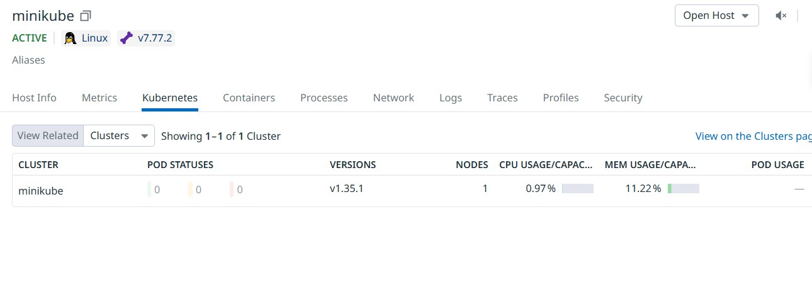
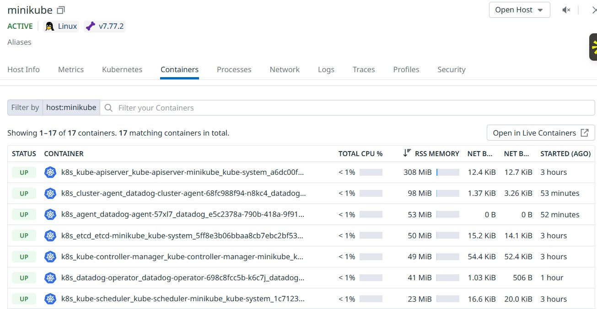
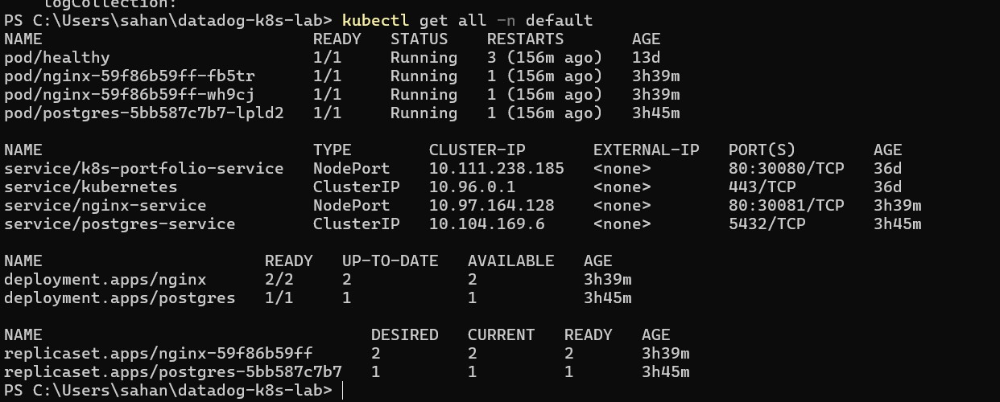
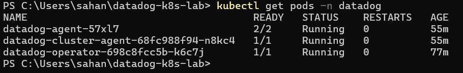

# Datadog Kubernetes Monitoring Lab

Production-grade monitoring setup for Kubernetes using Datadog.

## Overview

Built a complete observability stack on Minikube to demonstrate real-world monitoring capabilities:
- Kubernetes cluster monitoring with Datadog
- Application deployments (Nginx web server, PostgreSQL database)
- Infrastructure metrics collection
- Container-level resource tracking

## Architecture

**Infrastructure:**
- Minikube cluster (single-node Kubernetes)
- Datadog Agent deployed via Datadog Operator
- 2 sample applications for monitoring

**Applications Monitored:**
- **Nginx** (2 replicas) - Web server
- **PostgreSQL** - Database server

**Datadog Components:**
- Datadog Agent (DaemonSet) - Collects metrics, logs, traces
- Datadog Cluster Agent - Kubernetes metadata and orchestration
- Datadog Operator - Manages agent lifecycle

## What I Built

### 1. Infrastructure Monitoring
- Real-time Kubernetes cluster health tracking
- Node-level CPU and memory metrics
- Pod status and resource utilization

### 2. Container Monitoring
- Per-container CPU/memory usage
- Container lifecycle events
- Resource limit tracking

### 3. Application Monitoring
- Nginx web server metrics
- PostgreSQL database monitoring
- Service health checks

## Key Learnings

1. **Datadog Operator vs Helm:** Used Datadog Operator for declarative agent management instead of Helm charts
2. **Namespace organization:** Isolated Datadog components in dedicated namespace for clean separation
3. **Secret management:** Secured API credentials using Kubernetes secrets
4. **Resource visibility:** Monitored applications across default and system namespaces

## Files

- `nginx-deployment.yaml` - Nginx web server deployment
- `postgres-deployment.yaml` - PostgreSQL database deployment
- `datadog-agent.yaml` - Datadog Agent configuration via Operator
- `screenshots/` - Datadog dashboard and metrics screenshots

## Screenshots

### Kubernetes Infrastructure View


### Container Metrics


### Container Metrics


### Datadog Agent Running


## How to Reproduce

### Prerequisites
- Minikube installed
- kubectl installed
- Datadog account (free trial)

### Step 1: Start Minikube
```bash
minikube start --driver=docker --memory=4096 --cpus=2
```

### Step 2: Deploy Applications
```bash
kubectl apply -f nginx-deployment.yaml
kubectl apply -f postgres-deployment.yaml
```

### Step 3: Install Datadog Operator
```bash
helm repo add datadog https://helm.datadoghq.com
helm install datadog-operator datadog/datadog-operator -n datadog --create-namespace
```

### Step 4: Create Datadog Secret
```bash
kubectl create secret generic datadog-secret \
  --from-literal=api-key=YOUR_API_KEY \
  -n datadog
```

### Step 5: Deploy Datadog Agent
```bash
kubectl apply -f datadog-agent.yaml
```

### Step 6: Verify Installation
```bash
kubectl get pods -n datadog
kubectl get pods -n default
```

## Tech Stack

- **Kubernetes:** Container orchestration
- **Minikube:** Local Kubernetes cluster
- **Datadog:** Observability platform
- **Nginx:** Web server
- **PostgreSQL:** Database
- **Helm:** Kubernetes package manager

## Skills Demonstrated

- Kubernetes deployment and management
- Observability platform integration
- Infrastructure monitoring setup
- Container orchestration
- Declarative configuration management
- Production monitoring best practices
